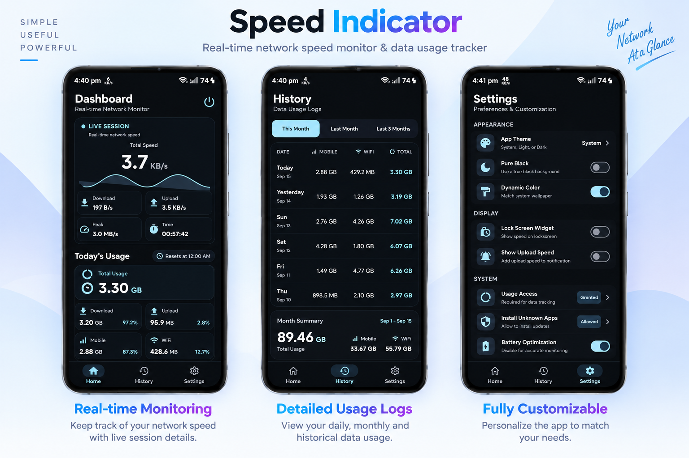

<p align="center">
  
</p>

<p align="center">
  A modern Android network speed monitor that keeps real-time traffic speed and data usage visible at a glance.
</p>

<p align="center">
  
  
  
  <a href="https://github.com/Darkstar085/SpeedIndicator/actions/workflows/build.yml"></a>
  
</p>

---

## ✨ Features

- ⚡ Real-time download and upload speed monitoring
- 📊 Live speed waveform with peak speed and session duration
- 📶 Separate Wi-Fi and mobile data usage tracking
- 📅 Daily, monthly, and historical usage logs
- 🎨 System, light, and dark themes with dynamic color support
- 🔔 Optional persistent notification speed monitor
- 🔒 Usage Access and Battery Optimization controls
- ⬇️ In-app update download and installation
- 🚀 Foreground service with automatic startup after reboot
- 📱 Modern Jetpack Compose and Material 3 UI

## 🖼️ Screenshots

<p align="center">
  
</p>

## 🧰 Tech Stack

- **Kotlin**
- **Jetpack Compose**
- **Material 3**
- **AndroidX**
- **Hilt**
- **Room**
- **WorkManager**
- **Kotlin Serialization**
- **Gradle**

## 🚀 Quick Start

### Requirements

- Android Studio
- JDK 17
- Android SDK 37 for development
- Android 9.0 (API 28) or newer for the app

### Clone

```bash
git clone https://github.com/Darkstar085/SpeedIndicator.git
cd SpeedIndicator
```

### Build

```bash
./gradlew assembleDebug
```

The generated debug APK is available under `app/build/outputs/apk/debug/`.

## 📦 Releases

Download the latest APK from the [latest release](https://github.com/Darkstar085/SpeedIndicator/releases/latest), or browse all available builds on the [Releases](https://github.com/Darkstar085/SpeedIndicator/releases) page.

## 🔐 Permissions

Speed Indicator uses Android's network and usage statistics APIs to measure traffic and present usage information. Some features require additional system access, which can be enabled from **Settings** inside the app.

- **Usage Access** — required for data usage tracking.
- **Battery Optimization** — can be disabled to improve continuous monitoring reliability.
- **Install Unknown Apps** — required when installing updates downloaded directly by the app.

## 💡 Inspiration

The project was inspired by the open-source **[NetSpeedIndicator](https://github.com/ronyaburaihan/NetSpeedIndicator)**. It influenced the initial concept of building an Android network speed and data usage monitor.

## 🤝 Contributing

Bug reports, suggestions, and improvements are welcome. Please keep contributions focused and follow the existing Kotlin and Jetpack Compose conventions.

## 📄 License

Speed Indicator is licensed under the [MIT License](LICENSE).

---

<p align="center">
  <strong>Speed Indicator</strong> — Know your network at a glance.
</p>
